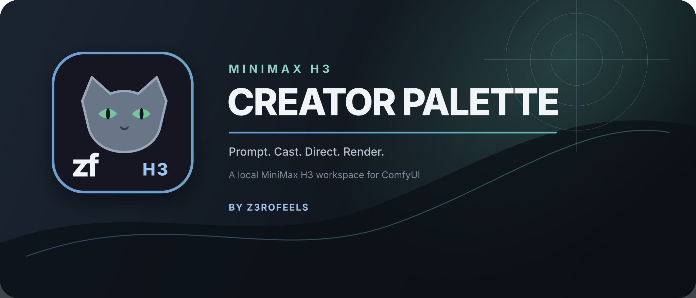

# MiniMax H3 Creator Palette

Your local MiniMax H3 creation workspace for ComfyUI.

Creator Palette combines prompt authoring, Cast, scene categories, references, LoRAs, shot planning, sampling, preview, decode and output in one focused workspace. Advanced tools remain optional, and normal ComfyUI queue behavior stays normal.

Made with care by [z3rofeels](https://github.com/z3rofeels), creator of [Prompt Palette](https://github.com/z3rofeels/comfyui-promptpalette).

> [!IMPORTANT]
> Creator Palette is currently a community beta. Its main workflows are functional, but MiniMax H3, ComfyUI and optional accelerator integrations continue to evolve. If you find a show-stopping bug, please report it with your versions, hardware, reproduction steps and a sanitized workflow.

> [!NOTE]
> Creator Palette runs locally. It does not bundle or download models, LoRAs, VAEs, LLMs, third-party custom nodes or generated media. It has no telemetry, hosted prompt service or paid API dependency.

## Nodes

| Node | Purpose |
| --- | --- |
| **MiniMax H3 Creator Palette** | Complete MiniMax H3 video authoring, generation and output workspace |
| **MiniMax H3 PreStage** | Optional still-image preparation, review and explicit Creator handoff |

Both appear under **z3rofeels → Video**.

## Requirements

- **ComfyUI v0.34.0 or newer**
- Python 3.10 or newer
- A current ComfyUI frontend
- Your own compatible local MiniMax H3 model, text encoder and VAE files

ComfyUI v0.34.0 is the minimum because Creator Palette uses the current H3 special-token contract and native arbitrary-frame guide support.

Creator Palette declares no extra Python packages. The required runtime libraries are already part of a current ComfyUI installation.

## Installation

### ComfyUI Manager — recommended

1. Open **Manager** in ComfyUI.
2. Search for **MiniMax H3 Creator Palette**.
3. Click **Install**.
4. Restart ComfyUI and hard-refresh the browser with **Ctrl+F5**.

Registry package ID: **zf-h3-creator-palette**  
Publisher: **z3rofeels**

### Git

```bash
cd ComfyUI/custom_nodes
git clone https://github.com/z3rofeels/ComfyUI-MiniMax-Creator-Palette.git
```

Restart ComfyUI and hard-refresh the browser.

### Manual ZIP

Extract the release so the extension has this shape:

```text
ComfyUI/
└── custom_nodes/
    └── ComfyUI-MiniMax-Creator-Palette/
        ├── __init__.py
        ├── creator_node.py
        ├── pyproject.toml
        ├── default_h3_pack.json
        └── js/
```

When updating manually, replace the old extension folder cleanly. Do not copy a new release over older files, because retired frontend files can remain behind.

## First render

1. Add **MiniMax H3 Creator Palette**.
2. Open **Setup / Settings → Models** and select your local H3 files.
3. Write a normal prompt or insert items from the Scene Builder.
4. Choose length, aspect, resolution, steps, sampler and scheduler.
5. Add first/last frames or references only when the shot needs them.
6. Open **Inspect** to review the exact compiled prompt and route.
7. Queue normally.

Creator Palette can remain a single-shot node. Cast, Director, PreStage, Seed Hunt, local refine, face repair, two-pass output and optional accelerators are available when you need them.

## What Creator Palette adds

- Prompt Palette editing with visible semantic syntax and local wildcards
- Raw prompt mode or optional H3 Auto Format
- Scene categories with deterministic fixed, random, next and previous behavior
- Cast Studio with reusable characters, thumbnails, groups, swapping and auditions
- Image, video and audio reference management
- T2VA, I2VA, L2VA, FL2VA and Ref2VA route detection
- Shot cards and an optional storyboard timeline
- Per-shot and global LoRAs, including timed LoRA cues
- PreStage image review and explicit image-to-video handoff
- Seed Hunt for one-to-four controlled draft comparisons
- Direct or two-pass rendering, final decode, mux and save
- Live workload guidance and optional accelerator diagnostics
- Global history coverage and persistent harmless UI preferences

All creative workflow values save with the node. Machine/device preferences stay local to the current ComfyUI installation.

## Prompt authoring

The editor accepts ordinary natural-language text alongside Creator Palette syntax:

| Syntax | Meaning |
| --- | --- |
| `@Character` | Use a Cast character |
| `@Character+` / `@Character-` | Step forward or backward through Cast variations |
| `$location`, `$camera`, etc. | Insert a semantic Scene category |
| `$location+` / `$location-` | Step through the complete live category |
| `__weather__` | Resolve a local wildcard |
| `__+weather__` / `__-weather__` | Deterministic wildcard stepping |

### Raw and H3 Auto Format

**H3 Auto Format is off by default.**

- **Raw** preserves the resolved order and wording from the editor.
- **H3 Auto Format** restructures the same resolved text into Creator Palette's H3 Context-IR form.

Both modes still resolve wildcards, categories, Cast, references, LoRA triggers, timed direction, soundscape and music. The source editor is never destructively replaced by resolved output.

### Categories and auditions

Canonical Scene slots are Location, Clothing, Props, Action, Camera, Lighting, Dialogue, Ambience and Music.

- `+` and `-` traverse the complete respective category.
- Fixed mode keeps the chosen item.
- Random mode resolves deterministically from the queue seed.
- A shortlist is used only when **Audition Shortlist** is explicitly activated.
- Inspector preview and Queue use the same resolved prompt text.

## Cast Studio

Cast records and prompt mentions are separate:

- **Remove @** removes a role from the active prompt without deleting the character.
- **Delete from this Creator** removes the workflow character and its mentions.
- **Delete from reusable pack** removes the reusable preset without silently erasing workflow state.

Clicking an exact `@character` token and choosing **Swap** enters explicit swap mode. Click another Character Gallery card to replace the role immediately.

Cast Studio also exposes the current-shot role selector, **Swap role** and **Audition** controls when opened through the sidebar, Director or node panel. Outside swap mode, cards continue to open the Character Inspector. The Inspector provides direct Use/Swap and Audition actions.

The shipped Cast contains five fictional adult non-human examples. They are SFW, editable and removable.

## Scene Builder and packs

The Scene Builder provides local editable entries for Cast, Locations, Clothing, Props, Action, Camera, Lighting and Audio.

Pack imports are previewed before mutation:

- **Append safely** adds new IDs and preserves conflicts.
- **Replace imported sections** changes only incoming non-empty sections.
- **Advanced: Replace EVERYTHING** performs a complete pack swap.

The latest import receives a local rollback archive. User packs, thumbnails and backups live in ComfyUI's user directory—not inside the installed extension.

See [Pack authoring and import safety](docs/PACKS.md).

## Media, references and H3 routes

Creator Palette works with local ComfyUI images, videos and audio:

- **T2VA** — text only
- **I2VA** — first frame
- **L2VA** — last frame
- **FL2VA** — first and last frame
- **Ref2VA** — multimodal references

The effective route is derived from the media actually attached to the shot. Director planning labels cannot force a route that the payload does not support.

Reference images can target a person, object, scene or style. Reference video can contribute motion, camera, edit structure or continuation. Audio can contribute voice, music, ambience or a copied audio role.

## Storyboard Timeline Director

The optional Director is a timeline view over the same Creator workflow—not a second renderer.

It provides:

- duration-scaled shot cards;
- source thumbnails and reference roles;
- draggable image/video/audio blocks;
- timed action, dialogue, voiceover, sound, LoRA and transition beats;
- editable camera points;
- the canonical Shot Inspector and compiled-prompt preview.

A Reference block can optionally enable **H3 Pin**. The reference remains in the normal Ref2VA pool and is additionally anchored at the block's start frame through ComfyUI's native H3 guide conditioning. H3 Pin is off by default and never changes an existing workflow silently.

See [Storyboard Timeline Director](docs/TIMELINE_DIRECTOR.md).

## Models, LoRAs and performance

Model selectors use ComfyUI's local model folders. Optional controls appear only when their compatible provider is installed.

Creator Palette supports:

- base and INT8 ConvRot H3 checkpoints;
- native or INT8 ConvRot video VAEs;
- global, per-shot and timed LoRAs;
- Full Turbo and Hybrid schedules;
- the explicit LightX2V H3 Turbo v1.0 four-step recipe;
- first-block cache families, Spectrum, Sage/Kitchen attention and Chunk FFN paths;
- the optional H3-Optimizations provider;
- TinyVAE/`taeh3` live previews.

Every accelerator remains opt-in. Creator Palette reports missing or conflicting providers instead of silently substituting another path.

The workload panel estimates relative H3 transformer work from frame alignment, video/audio packing, resolution, steps, merged passes, held takes, two-pass rendering and face repair. It does not pretend to predict exact wall-clock render time.

## PreStage and Seed Hunt

### PreStage

PreStage is an optional local still generator and review workspace. It supports:

- Review, then video
- Image only
- Auto image → video
- Bypass PreStage

Results are saved through ComfyUI's normal image-output path. Creator handoff is explicit so graph execution order cannot silently choose an image for the user.

### Seed Hunt

Seed Hunt is disabled by default. When enabled, it compares one to four sequential low-cost drafts while holding wildcard and audition prose steady. Choosing a result locks the seed for the original full workflow; draft settings do not overwrite final resolution, duration, models, LoRAs or references.

## Local data and privacy

Creator Palette keeps these under ComfyUI's user directory:

- editable packs and Cast;
- thumbnails;
- pack-import backups;
- wildcard data;
- local settings and UI preferences.

A separate Prompt Palette installation keeps its own library and wildcard configuration. The two projects share authoring conventions and appearance behavior without overwriting one another's data.

## Troubleshooting

Before reporting a problem:

1. Update ComfyUI and Creator Palette.
2. Restart ComfyUI completely.
3. Hard-refresh the browser with **Ctrl+F5**.
4. Confirm the folder is named `ComfyUI-MiniMax-Creator-Palette`.
5. Reproduce the issue in a new workflow when possible.
6. Check the browser console and ComfyUI log for the first relevant error.

A useful bug report includes:

- Creator Palette version;
- ComfyUI and frontend versions;
- Nodes 1 or Nodes 2;
- operating system, GPU and VRAM;
- exact reproduction steps;
- relevant browser/backend errors;
- a sanitized workflow when possible.

Remove private prompts, personal media, usernames, local paths and model metadata before uploading anything.

[Report a bug](https://github.com/z3rofeels/ComfyUI-MiniMax-Creator-Palette/issues/new/choose) · [Request an improvement](https://github.com/z3rofeels/ComfyUI-MiniMax-Creator-Palette/issues/new/choose) · [Prompt Palette](https://github.com/z3rofeels/comfyui-promptpalette)

## Credits

Creator Palette builds on open-source community work:

- [ComfyUI](https://github.com/Comfy-Org/ComfyUI)
- [z3rofeels/comfyui-promptpalette](https://github.com/z3rofeels/comfyui-promptpalette)
- [cicalooo/ComfyUI-H3-PowerLoraStack](https://github.com/cicalooo/ComfyUI-H3-PowerLoraStack)
- [Zironic/H3-Optimizations](https://github.com/Zironic/H3-Optimizations), optional and not bundled


## License

MiniMax H3 Creator Palette is distributed under **GPL-3.0-only**. See [LICENSE](LICENSE).

Made with care by **z3rofeels**.
